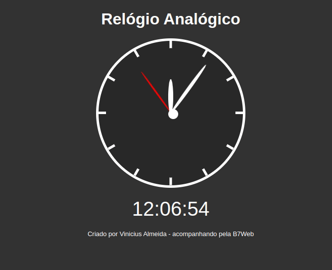

# Relogio Analogico e Digital
Desáfio para utilizar o próprio sistema para informar as Horas, minutos e segundos.

###  Captura de tela

###  Links

- URL da solução: [https://github.com/viniciusMaranhao/Relogio-Analogico-e-digital]
- URL do site ao vivo: [https://viniciusmaranhao.github.io/Relogio-Analogico-e-digital/]

##  Construído com

 
  
  
  

